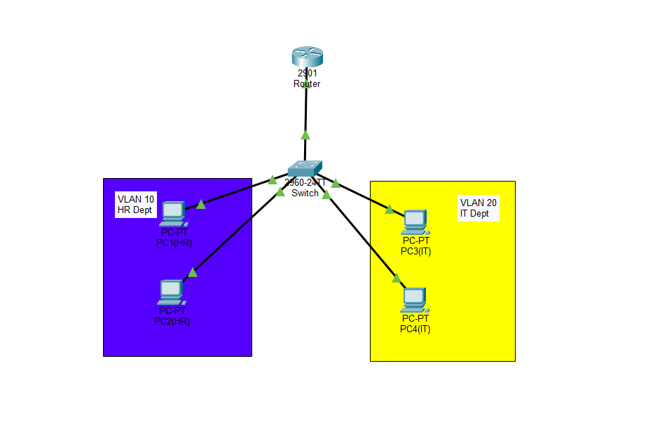

# VLAN Network Project (Cisco Packet Tracer)

## 📌 Project Overview
This project demonstrates VLAN configuration and inter-VLAN communication using the router-on-a-stick method in Cisco Packet Tracer. A single router interface is used to route traffic between multiple VLANs configured on a switch.

---

## 🧱 Network Design
- 1 Router (GigabitEthernet0/0)
- 1 Switch
- 4 PCs

### VLAN Details
- VLAN 10 (HR): PC1, PC2
- VLAN 20 (IT): PC3, PC4

### Connections
- PC1 → Fa0/1
- PC2 → Fa0/2
- PC3 → Fa0/3
- PC4 → Fa0/4
- Router → Fa0/5 (Trunk Port)

---

## ⚙️ Configuration Steps

### 1. VLAN Creation (Switch)
- Created VLAN 10 and VLAN 20

### 2. Port Assignment
- Assigned Fa0/1 and Fa0/2 to VLAN 10
- Assigned Fa0/3 and Fa0/4 to VLAN 20

### 3. Trunk Configuration
- Configured Fa0/5 as trunk port to connect switch and router

### 4. Router Configuration (Router-on-a-Stick)
- Enabled GigabitEthernet0/0
- Created sub-interfaces:
  - G0/0.10 for VLAN 10
  - G0/0.20 for VLAN 20
- Configured encapsulation dot1Q
- Assigned IP addresses as default gateways

---

## 🖥️ IP Addressing

### VLAN 10 (HR)
- Network: 192.168.10.0/24
- Default Gateway: 192.168.10.1

### VLAN 20 (IT)
- Network: 192.168.20.0/24
- Default Gateway: 192.168.20.1

---

## 🔄 Inter-VLAN Routing
Inter-VLAN communication is achieved using the router-on-a-stick method, where a single router interface handles multiple VLANs using sub-interfaces.

---

## 💻 CLI Configuration

### 🔹 Switch Configuration
```bash
enable
configure terminal

vlan 10
name HR

vlan 20
name IT

interface fa0/1
switchport mode access
switchport access vlan 10

interface fa0/2
switchport mode access
switchport access vlan 10

interface fa0/3
switchport mode access
switchport access vlan 20

interface fa0/4
switchport mode access
switchport access vlan 20

interface fa0/5
switchport mode trunk

end
write memory
```

### 🔹 Router Configuration
```bash
enable
configure terminal

interface gigabitEthernet0/0
no shutdown

interface gigabitEthernet0/0.10
encapsulation dot1Q 10
ip address 192.168.10.1 255.255.255.0

interface gigabitEthernet0/0.20
encapsulation dot1Q 20
ip address 192.168.20.1 255.255.255.0

end
write memory
```
## 📸 Network Topology


---

## ✅ Testing & Verification
- Verified all interfaces are in UP state  
- Tested connectivity using ping  
- Successful communication within same VLAN  
- Successful communication between VLAN 10 and VLAN 20  

---

## 🧠 Skills Learned
- VLAN configuration  
- Switch port assignment  
- Trunk configuration  
- Inter-VLAN routing (Router-on-a-Stick)  
- IP addressing and default gateway setup  
- Network troubleshooting using ping  

---

## 📂 Project File
vlan-project.pkt
images/topology.png