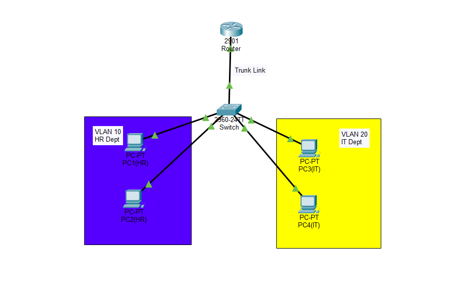

# VLAN Network Project (Cisco Packet Tracer)

## 📌 Project Overview
This project demonstrates VLAN configuration, inter-VLAN communication using the router-on-a-stick method, and DHCP-based automatic IP address assignment in Cisco Packet Tracer. A single router interface is used to route traffic between multiple VLANs configured on a switch, while DHCP is used to dynamically assign IP addresses to devices in each VLAN.

---

## 🧱 Network Design
- 1 Router (GigabitEthernet0/0)
- 1 Switch
- 4 PCs

### VLAN Details
- VLAN 10 (HR): PC1, PC2
- VLAN 20 (IT): PC3, PC4

### Connections
- PC1 → fa0/1
- PC2 → fa0/2
- PC3 → fa0/3
- PC4 → fa0/4
- Router → fa0/5 (Trunk Port)

---

## ⚙️ Configuration Steps

### 1. VLAN Creation (Switch)
- Created VLAN 10 and VLAN 20

### 2. Port Assignment
- Assigned fa0/1 and fa0/2 to VLAN 10
- Assigned fa0/3 and fa0/4 to VLAN 20

### 3. Trunk Configuration
- Configured fa0/5 as trunk port to connect switch(fa0/5) and router (g0/0).

### 4. Router Configuration (Router-on-a-Stick)
- Enabled g0/0
- Created sub-interfaces:
  - g0/0.10 for VLAN 10
  - g0/0.20 for VLAN 20
- Configured encapsulation dot1Q
- Assigned IP addresses as default gateways

### 5. Router Configuration (DHCP)

- Configured router as DHCP server for dynamic IP allocation  
- Excluded gateway IP addresses to avoid IP conflicts  
- Created separate DHCP pools for VLAN 10 and VLAN 20  
- Defined network ranges and default gateways for each VLAN  
- Enabled automatic IP assignment to end devices  
---

## 🖥️ IP Addressing

### VLAN 10 (HR)
- Network: 192.168.10.0/24
- Default Gateway: 192.168.10.1
- IP Assignment: DHCP 

### VLAN 20 (IT)
- Network: 192.168.20.0/24
- Default Gateway: 192.168.20.1
- IP Assignment: DHCP 

---

## 🔄 Inter-VLAN Routing
Inter-VLAN communication is achieved using the router-on-a-stick method, where a single router interface handles multiple VLANs using sub-interfaces.
Router uses sub-interfaces with dot1Q encapsulation to route traffic between VLANs.

---

## 💻 CLI Configuration

### 🔹 Switch Configuration
```bash

enable
configure terminal

vlan 10
name HR

vlan 20
name IT

interface fa0/1
switchport mode access
switchport access vlan 10

interface fa0/2
switchport mode access
switchport access vlan 10

interface fa0/3
switchport mode access
switchport access vlan 20

interface fa0/4
switchport mode access
switchport access vlan 20

interface fa0/5
switchport mode trunk

end
write memory
```

### 🔹 Router Configuration
```bash

enable
configure terminal

interface g0/0
no shutdown

interface g0/0.10
encapsulation dot1Q 10
ip address 192.168.10.1 255.255.255.0

interface g0/0.20
encapsulation dot1Q 20
ip address 192.168.20.1 255.255.255.0

end
write memory
```

### 🔹 Router Configuration (DHCP)
```bash

ip dhcp excluded-address 192.168.10.1
ip dhcp excluded-address 192.168.20.1

ip dhcp pool VLAN10
network 192.168.10.0 255.255.255.0
default-router 192.168.10.1

ip dhcp pool VLAN20
network 192.168.20.0 255.255.255.0
default-router 192.168.20.1
exit
```
### 🔹 Router Configuration (DHCP Verification Command)
```bash
enable
show ip dhcp binding
show ip dhcp pool
show running-config | include dhcp
```
## 📸 Network Topology


---

## ✅ Testing & Verification
- Verified all interfaces are in UP state  
- Tested connectivity using ping  
- Successful communication within same VLAN  
- Successful communication between VLAN 10 and VLAN 20
- PCs received IP addresses automatically via DHCP
- Verified DHCP functionality using CLI commands.

---

## 🧠 Skills Learned
- VLAN configuration  
- Switch port assignment  
- Trunk configuration  
- Inter-VLAN routing (Router-on-a-Stick)  
- IP addressing and default gateway setup
- DHCP configuration and IP automation   
- Network troubleshooting using ping  

---

## 🔄 Project Evolution
- Version 1: VLAN + Inter-VLAN Routing  
- Version 2: Added DHCP for automatic IP assignment

## 📂 Project File
- vlan-project-v1.pkt
- vlan-project-v2-dhcp.pkt
- images/topology.png

---

## 📌 Conclusion
This project successfully demonstrates the implementation of VLAN segmentation, inter-VLAN communication using the router-on-a-stick approach, and DHCP-based automatic IP address assignment. It helped in understanding how logical network separation improves organization and security while still allowing controlled communication between VLANs.

Through this project, I gained practical experience in switch and router configuration, trunking, IP addressing, DHCP configuration, and basic network troubleshooting, building a strong foundation in networking concepts.
